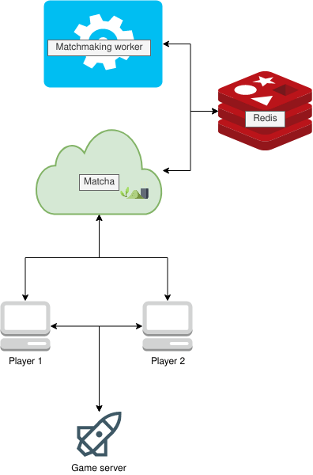

# Matcha
Matchmaking system for 1v1 competitive games.

## How it works

Matcha works using an API for user management and entering the queue and a worker for finding matches between players.

### API

The API allows users to be added to the Redis database and also allows users to queue up for a match.

The API uses the following commands:

- `JSON.SET` is used to add a player and to update a user's rating when a game is finished.
- `JSON.NUMINCRBY` is used to update the user's game played counter when a game is finished.
- `JSON.GET` is used to retrieve a user from the database using it's ID.
- `ZADD` is used to add a user to the queue.
- `SUBSCRIBE` is used to listen for matches found by the worker.
- `UNSUBSCRIBE` is used when a match is found for a user to clean up.

### Worker

Loop over all players and look for potential opponents. Publish a match when 2 opponents have been found within eachothers ELO-range.

The longer a player is queueing the bigger his ELO-range will be. It's important that a when a possible opponent is found that the player is also in the opponents player's ELO-range, this gives more balanced matches. It's also possible to cap out the ELO-range as to not get extreme ELO differences between players.

The worker runs every 10 seconds and uses the following commands:

- `ZSCAN` is used to get all players currently in the queue.
- `ZSCORE` is used to get a player from the queue and to see how long he has been in the queue.
- `ZRANGEBYSCORE` is used to get all players within an ELO-range to find possible opponents.
- `ZREM` is used to remove the players from the queue when a match has been found.
- `PUBLISH` is used to publish the match info to the API when a match is found.

## Usage

### Using `docker-compose`

1. `docker-compose up -d`
2. If `debug` mode is active you can go to http://0.0.0.0:8000/index.html to test the server.

## Configuration

Using the `MATCHA_ENVIRONMENT` you can enable/disable the testing page. When the variable is set to `debug`, the test page will be available at `/index.html`

## Acknowledgements

I would like to thank my cat.